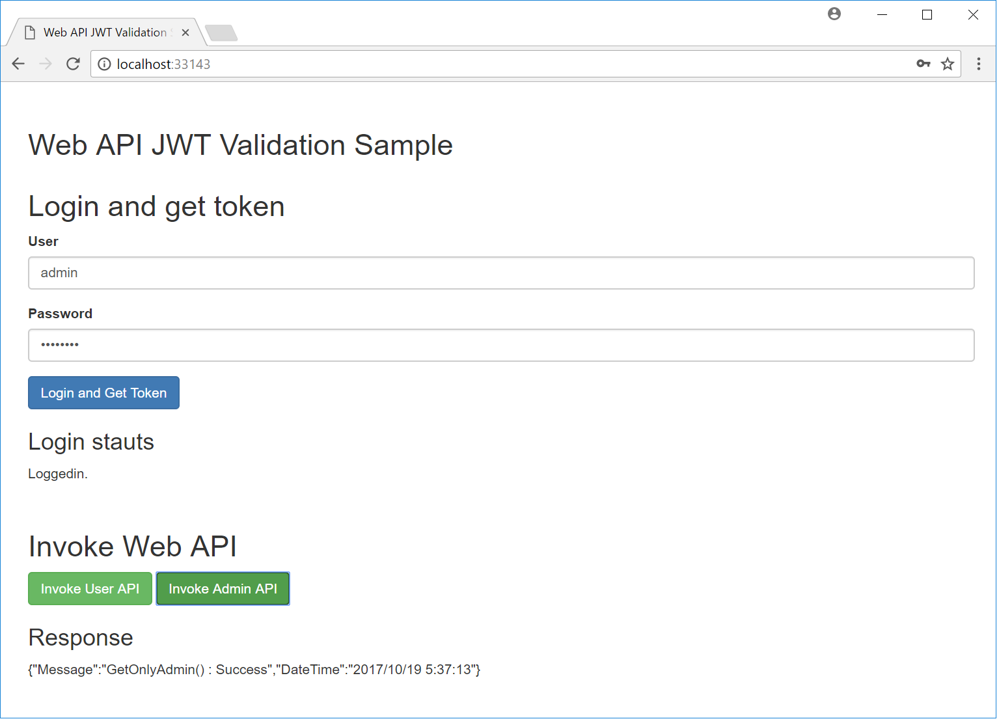

# ASP.NET Core 2.0 / Web API JWT Validation Sample

[Japanese](./README.ja.md)

This is sample of JWT Validation with ASP.NET Core 2.0. I created for self-study.

## Framework
+ Visual Studio 2017
+ ASP.NET Core 2.0
+ Chorme/Edge (IE does not support.)

## Run

1. Clone this repository.
2. Open solution.
3. Debug and Launch Browser.
4. If you input User to `admin`, you will be give `admin role`. Otherwise you will be give `user role`.
5. Click green button, Web API will be inovked. Left button is `admin role` only.

## Reference

[Authentication In An ASP.NET Core API - Part 3: JSON Web Token | Pioneer Code](https://pioneercode.com/post/authentication-in-an-asp-dot-net-core-api-part-3-json-web-token)
